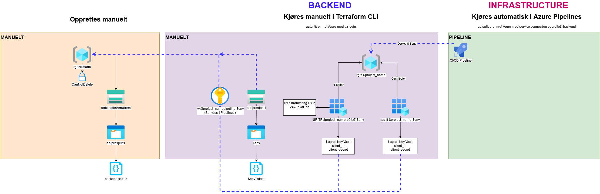

Terraform Backend module for Azure by blinQ
===========

A Terraform module to provision common backend infrastructure in Azure for new Terraform projects.

Diagram
-------

TODO
----
* Re-organize meta stuff like examples
* Replace Blob Container SAS with role_assignment

Deep dive
---------
This module will create the following resources per environment you provide.
* A resource group named `rg-project_name-${env}`
* A service principal named `sp-tf-project_name-${env}`
  * This service principal will be assigned the Contributor role to its respective resource group. Different roles can be configured via variables.
* A key vault named `kv-tf-${project_name}-${env}`
  * This Key Vault will be deployed to the backend resource group. The purpose of this Key Vault is to store the service principal's credentials.
* The authenticated user who runs this module will be given ["Set", "Get", "List", "Delete", "Purge", "Recover"] on `Secrets` in this key vault.
  *  Each service principal will be given ["Get", "List"] on `Secrets` in its respective key vault.
* A Storage Account named `sa${project_name}${random_integer}` that will hold each environments Storage Container (to store remote state)
* A Storage Container named `${env}` that will hold the state for each environment
* A Blob Container SAS (Shared Access Signature) per environments respective Storage Container

Per environment, the following secrets are stored in its respective Key Vault
* SAS to its respective Storage Container
* Authentication details to each service principal
  * client_id
  * client_secret
  * tenant_id
  * subscription_id
* Backend configuration needed for Terraform to use Remote State (per environment)
  * backend_resource_group_name
  * Storage Account name
  * Storage Container name
  * Key name

Requirements
------------
The module expects you to have pre-provisioned the following

1. A Resource Group - This module deploys a single Storage Account and one Storage Container(pr. environment) where remote state for the project infrastructure will reside.
2. A Storage Account - Required for the Storage Container in the next requirement
3. A Storage Container - This module will store its remote state in this location. (Make sure it is secured!)

Usage
-----
See the example folders for usage.

License
=======
GNU General Public License v3.0 / GNU GPLv3 

Read more here: https://choosealicense.com/licenses/gpl-3.0/
